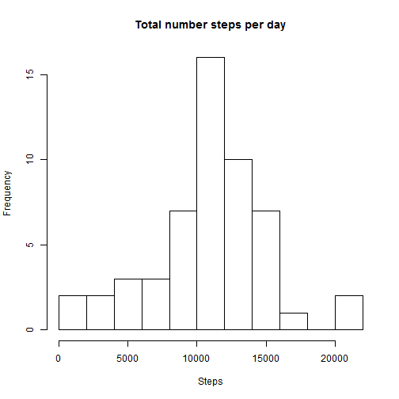
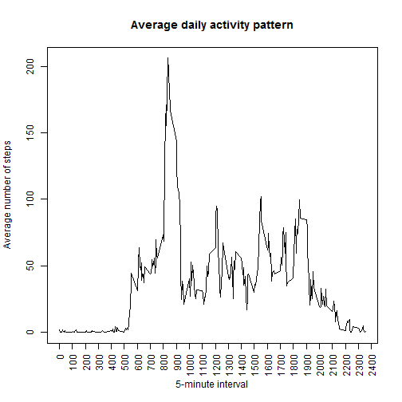
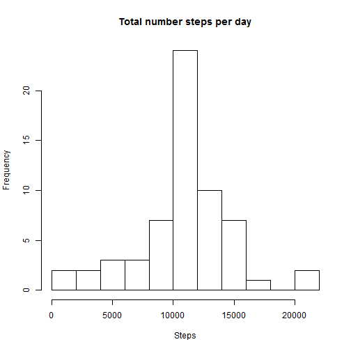
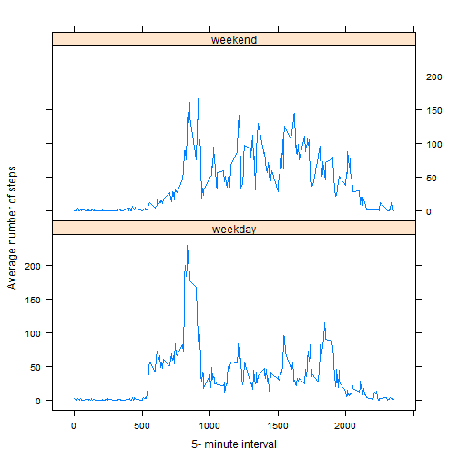

# Reproducible Research: Peer Assessment 1 jorgevillamizarco
=============================================================

## Loading and preprocessing the data

1.Loaddin data the data

  In order to read the data it's necessary to use the "read.csv" function and to specifying the location of activity.csv file (inside the activity folder)
  

```r
data <- read.csv("activity/activity.csv")
```


2.Processing and transforming the data

  Removing NA values with na.ommit function and transforming "data$date" row into date class in ordder to work with dates easily


```r
data <- na.omit(data)
data$date <- as.Date(data$date)
```


  Checking if the data$date column has the correct class and values
  

```r
class(data$date)
```

```
## [1] "Date"
```

```r
head(data, 2)
```

```
##     steps       date interval
## 289     0 2012-10-02        0
## 290     0 2012-10-02        5
```


## What is mean total number of steps taken per day?

1.Histogram of the total number of steps taken each day

  Calculation of the sum of steps per each day Using the aggregate function, then with the daySteps dataframe and hist function plot the histogram  


```r
daySteps <- aggregate(data$steps, by = list(data$date), FUN = sum)
colnames(daySteps) <- c("day", "steps")
hist(daySteps$steps, main = "Total number steps per day", xlab = "Steps", breaks = 10)
```

 


2.Mean and median total number of steps taken per day

  To calculate the median we need to use de mean function and to calcylate de median we use median function
  

```r
totalmean <- mean(na.omit(daySteps$steps))
totalmedian <- median(na.omit(daySteps$steps))
```


The mean total number of step taken per day is 1.0766 &times; 10<sup>4</sup> and the median is 10765


## What is the average daily activity pattern?

1.Plot of the 5-minute interval (x-axis) and the average number of steps taken, averaged across all days (y-axis)

First we have to calculate the mean for each interval over the complete dataset, with this new dataframe called "intervalMeans" we can plot the average number of steps for all days


```r
intervalMeans <- aggregate(data$steps, by = list(data$interval), FUN = mean)
colnames(intervalMeans) <- c("interval", "mean")
plot(intervalMeans, type = "l", main = "Average daily activity pattern", xlab = "5-minute interval", 
    ylab = "Average number of steps", xaxt = "n")
axis(1, at = seq(0, 2400, by = 100), las = 2)
```

 


2.Which 5-minute interval, on average across all the days in the dataset, contains the maximum number of steps?

  in order to calculate interval with maximum number of steps I use the order function sortin by mean and then extract the first value from the resulting dataframe "maxInterval"

```r
maxInterval <- intervalMeans[order(-intervalMeans[, 2]), ]
```


  So, the 5-min interval with the maximum number of steps in average is 835 with an average of 206.1698 steps 

## Imputing missing values

1.Calculate and report the total number of missing values in the dataset (i.e. the total number of rows with NAs)

  To calculate the total number of NAs I use the sum function in combination with the is.na function to test if a dataset value is NA or not


```r
data2 <- read.csv("activity/activity.csv")
sumNas <- sum(is.na(data2))
```


  The total number of NAs in the data set is 2304

2.Devise a strategy for filling in all of the missing values in the dataset. The strategy does not need to be sophisticated. For example, you could use the mean/median for that day, or the mean for that 5-minute interval, etc.

  To replace NA values firs we create a vector whit all the NAs positions, then I create a dataFilled with a copy of the origigal dataframe containing all NAs, then I make an for loop for all the indexes extracted and for using indexes for each NA value in dataFilled I replace the NA with the mean values previously calculated in intervalMeans. To select the correct mean value I extract the interval value with NA from data2 and with this value select the correct one in intervalMeans   


```r
NAindex <- as.numeric(which(is.na(data2[, 1])))
dataFilled <- data2
for (i in 1:length(NAindex)) {
    dataFilled[NAindex[i], 1] <- as.integer(intervalMeans[intervalMeans[, 1] == 
        data2[NAindex[i], 3], 2])
}
```


3.Create a new dataset that is equal to the original dataset but with the missing data filled in.

  To check that this new dataframe called dataFilled has no NAs I use the is.na function

```r
sum(is.na(dataFilled[, 1]))
```

```
## [1] 0
```


  And print the head to see it
  

```r
head(dataFilled)
```

```
##   steps       date interval
## 1     1 2012-10-01        0
## 2     0 2012-10-01        5
## 3     0 2012-10-01       10
## 4     0 2012-10-01       15
## 5     0 2012-10-01       20
## 6     2 2012-10-01       25
```


4.Make a histogram of the total number of steps taken each day and Calculate and report the mean and median total number of steps taken per day. Do these values differ from the estimates from the first part of the assignment? What is the impact of imputing missing data on the estimates of the total daily number of steps?

  Re plot the histogram with the new dataframe called dataFilled


```r
daySteps <- aggregate(dataFilled$steps, by = list(dataFilled$date), FUN = sum)
colnames(daySteps) <- c("day", "steps")
hist(daySteps$steps, main = "Total number steps per day", xlab = "Steps", breaks = 10)
```

 


  We can note that the 10.000 bar is higher than the previous one

  Recalculating mean and median
  

```r
totalmean <- mean(na.omit(daySteps$steps))
totalmedian <- median(na.omit(daySteps$steps))
```


  The new mean total number of step taken per day is 1.075 &times; 10<sup>4</sup> and the median is 10641

  We can infer that replacing NAs with aproximate values will probably give us a much more approximate result, but we can ignore them with no problem from the begining and the result will no change in a considerable way    
  
  
## Are there differences in activity patterns between weekdays and weekends?

1.Create a new factor variable in the dataset with two levels - "weekday" and "weekend" indicating whether a given date is a weekday or weekend day.

  First it's necessary to create two additional columns "day" and "daytype" to put all new values, then using the ifelse and weekdays functions the "mean" column on dataFilled dataframe is filled. Then using the aggregate function the dataFilledMeans dataframe is created with the step averages for each daytype and eahc interval 


```r
dataFilled["day"] <- weekdays(as.Date(dataFilled$date))
dataFilled["daytype"] <- as.Date(character(0))
dataFilled$daytype <- ifelse(!is.element(weekdays(as.Date(dataFilled$date)), 
    c("sábado", "domingo")), "weekday", "weekend")
dataFilledMeans <- aggregate(dataFilled$steps, by = list(dataFilled$daytype, 
    dataFilled$interval), FUN = mean)
colnames(dataFilledMeans) <- c("daytype", "interval", "mean")
```


2.Make a panel plot containing a time series plot (i.e. type = "l") of the 5-minute interval (x-axis) and the average number of steps taken, averaged across all weekday days or weekend days (y-axis).

  To make the plot the xyplot function is used, passing the dataFilledMeans dataframe 

```r
library(lattice)
xyplot(mean ~ interval | daytype, data = dataFilledMeans, type = "l", layout = c(1, 
    2), xlab = "5- minute interval", ylab = "Average number of steps", )
```

 


As we can see, the activity on weekend begins later in the morning than on weekdays, also, on weekens the steps activity is more spread over the day than on weekdays, where the peak of steps activity is clearly in the beginning of the day.  

